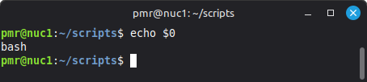

# bash shell scripting  

Check for what is the current shell...; normally, this will display as: bash.  

> echo $0  

-----

## Writing bash script files [.sh]  

**NOTE(S)**  

**NOTE(1)**: Bash script files are saved using filename.extension: [.sh]  

**NOTE(2)**: Bash script files begins with the line:   

> #!/bin/bash  

-----

## Let's write/save/make executable/run our 1st bash script file: hw.sh  

1. Open Nano *text editor' software application;     
   and, then, pass into it the name of our bash script file:  

nano hw.sh

2. Inside of Linux Nano *text editor* application,  
write a list of bash scripting commands that are each to be carried out.          

-(These commands may be either a single command/or else, multiple commands, instead;   
  each command is written down going one single line at a time.)-  

> #!/bin/bash  
> echo "Hello. world!"  

3. Save the file as being called: hw.sh  

4. Next, make the script executable:     

> chmod u+x hw.sh  

-(If the script hasn't actually been given executable privilege...; then, it **won't** run...?!)-  

5. Finally, call/or, run the script using:  

> ./hw.sh  

...or, alternatively...  

>  bash hw.sh  

...the output should display as:  

Hello, world!  
